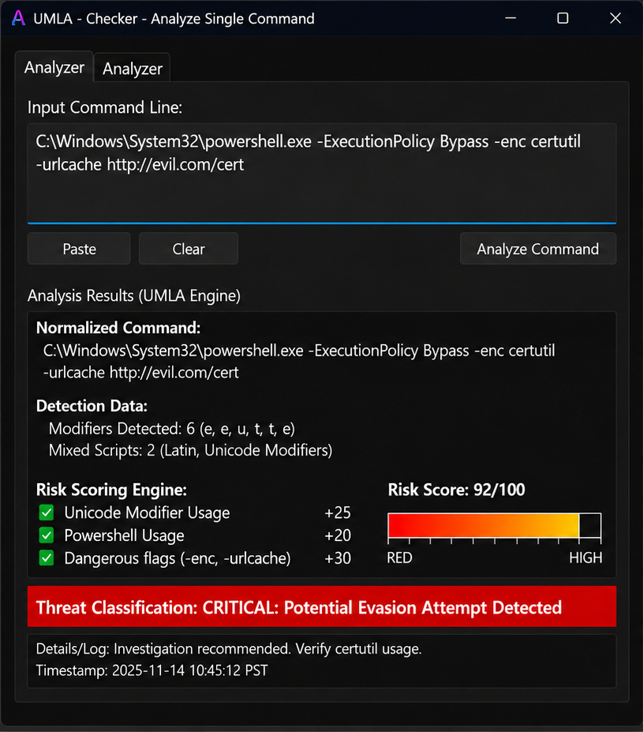

# UMLA Novelty Integration Package

This code builds upon the original **Unicode Modifier Letter Evasion Attack** project by adding a new layer of defense.

## What changed

The core features from the original research remain exactly the same:
- Cleaning up tricky Unicode modifier letters back into normal text
- Finding hidden or disguised commands
- Generating detailed reports of what was found

The new feature we added is a **risk-scoring system** that:
- cleans up special modifier letters,
- measures how heavily the text is disguised,
- warns you if the text mixes different alphabets or uses tricks to change text direction (like right-to-left),
- gives the text an easy-to-read risk score,
- ranks the most likely attack attempts before checking them against security rules.

## Main source files

- `src/libumlec/libumlec.h`
- `src/libumlec/libumlec.cpp`
- `src/libumlec/risk_rules.h`
- `src/analyzer/analyzer.cpp`
- `src/checker/checker.cpp`

## How to use

The project is set up so both of these tools can use the same scoring system:
- the analyzer tool, and
- the checker tool.

The `checker.cpp` file is a standalone demo you can run in your terminal.  
The interface displays:
- original text
- cleaned-up text
- number of hidden characters replaced
- risk score
- final decision and why it was made

## Extra files

- `examples/sample_commands.txt` — examples of disguised commands to test with
- `tests/expected_output_snippets.txt` — expected results to check if the code works correctly
- `NOVELTY_NOTES.md` — detailed notes on exactly where the new features were added# UMLA Novelty Integration Package
